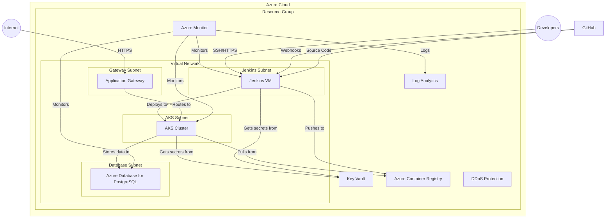
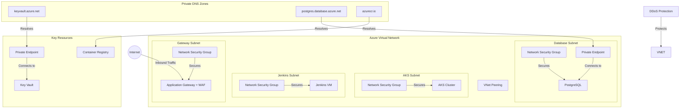
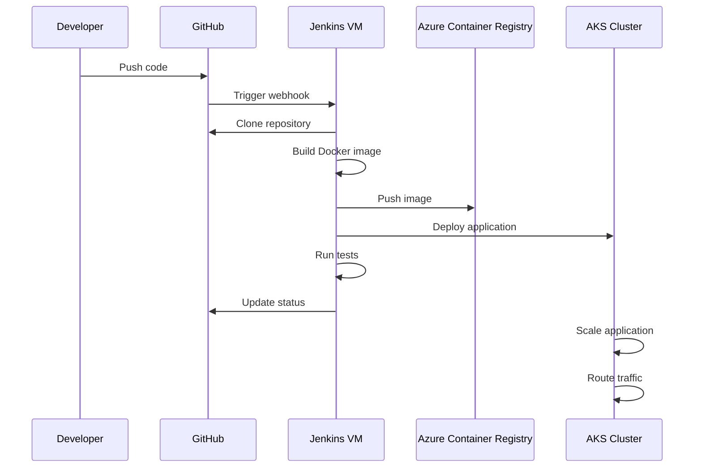
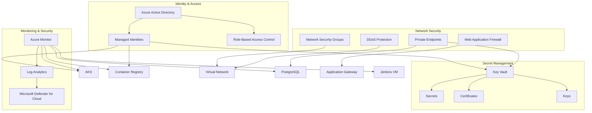
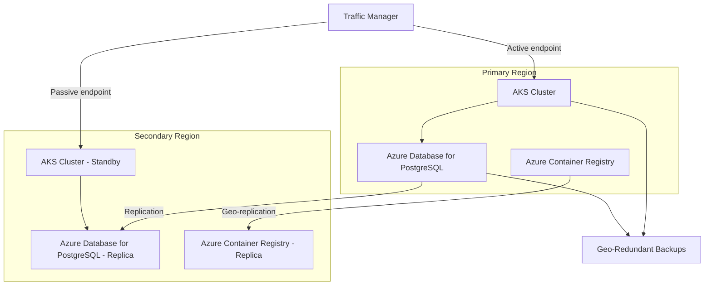

# Architecture Diagrams

## Azure AKS Jenkins GitHub Architecture

The following diagram illustrates the Azure architecture for the AKS Jenkins GitHub integration:

## Network Architecture

The following diagram shows the network architecture with security components:

## CI/CD Pipeline Flow

The following diagram illustrates the CI/CD pipeline flow from GitHub to AKS:

## Security Components

The following diagram shows how the security components integrate:

## High Availability and Disaster Recovery

